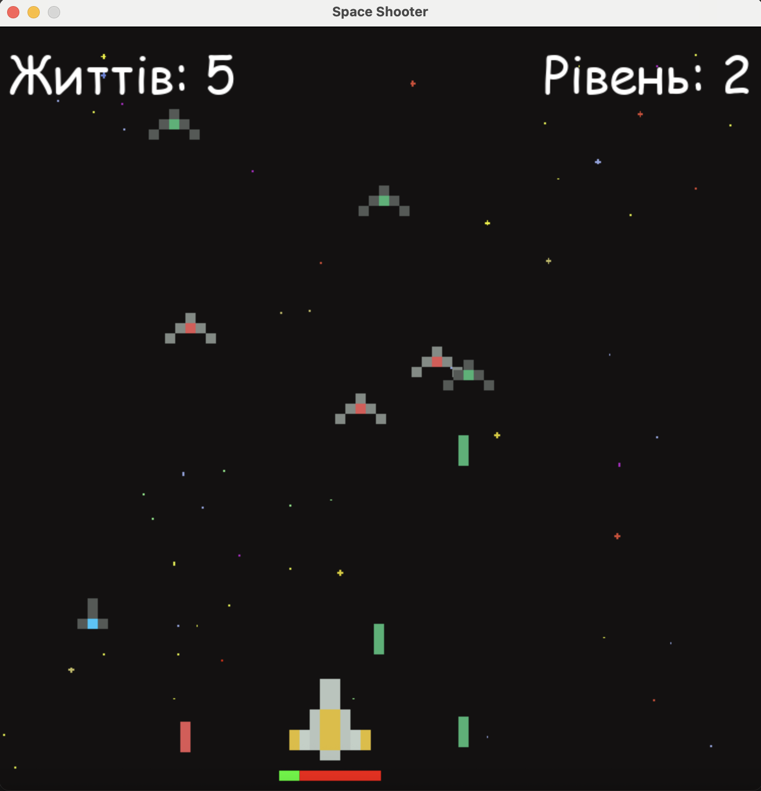

# 🎮 Pygame Arcade Pack

Колекція простих 2D-ігор, створених з використанням бібліотеки **Pygame**. У цьому репозиторії представлені:

- 🐤 Flappy Bird Clone
- 🚀 Space Shooter

---

## 🐤 Flappy Bird Clone

Реалізація популярної гри, в якій потрібно натисканням клавіші керувати пташкою, пролітаючи між перешкодами.

**Особливості:**
- Анімація пташки
- Нескінченна генерація труб
- Рахунок очок
- Простий та ефективний геймплей

📸 **Скріншот:**


---

## 🚀 Space Shooter

Класичний космічний шутер, де ви керуєте кораблем і знищуєте ворогів.

**Особливості:**
- Корабель з керуванням
- Постріли, зіткнення, знищення ворогів
- Підрахунок очок

📸 **Скріншот:**



---

## 🚀 Запуск

1. Встанови [Python](https://www.python.org/) та [Pygame](https://www.pygame.org/):

```bash
pip install pygame
